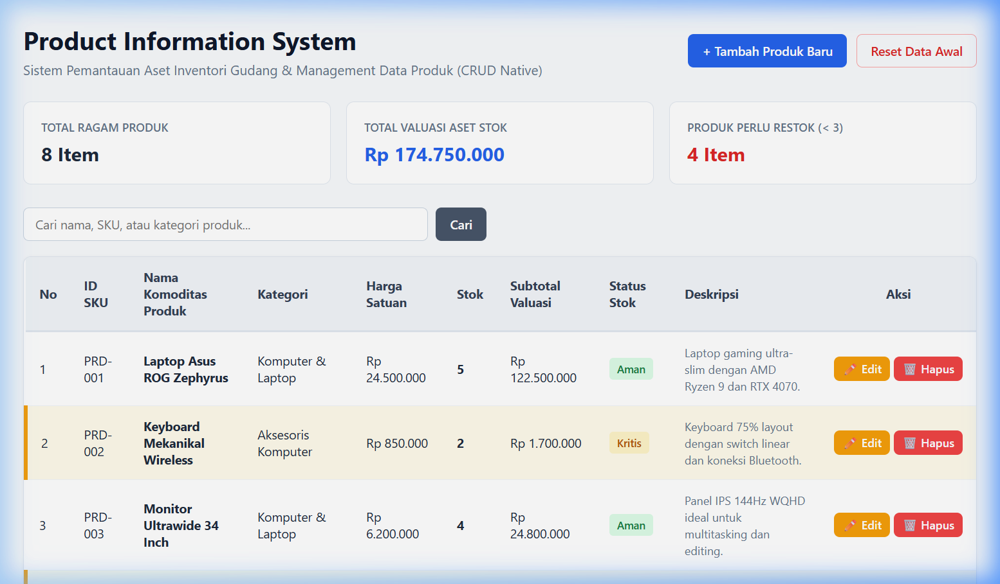
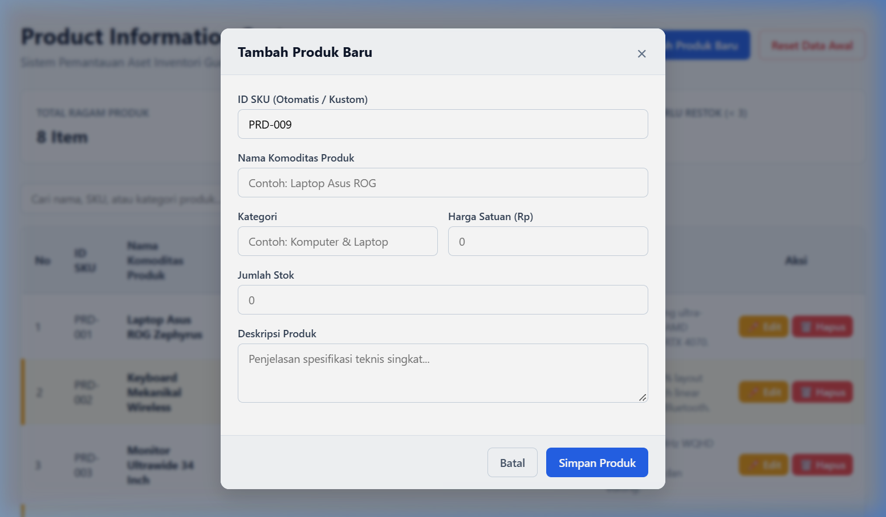
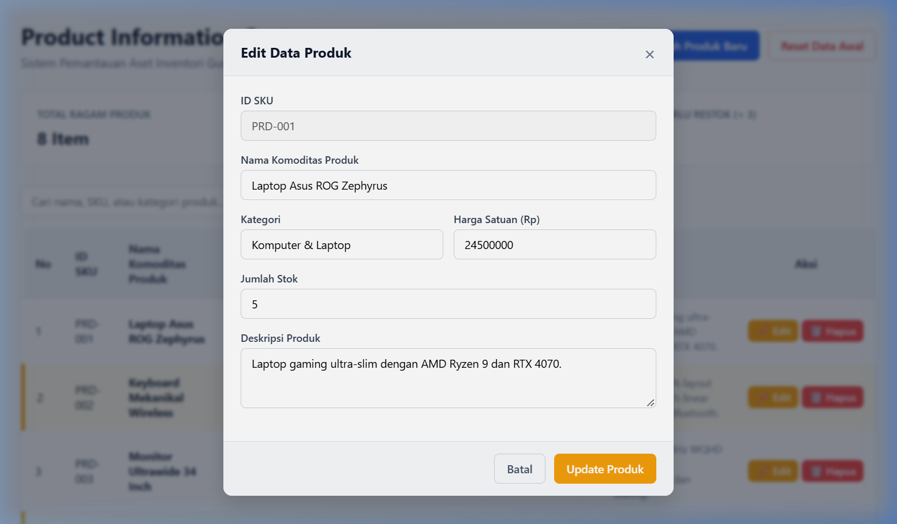

# Mini Project 1: Product Information System

> **Mata Kuliah:** Pemrograman Web (Pertemuan 2)  
> **Fokus Utama:** Server-Side Programming, Multidimensional Associative Array, Modular Architecture (Separation of Concerns), & Operasi CRUD Native.  
> **Engine:** PHP Native (Murni tanpa Framework & tanpa Database SQL Eksternal).

---

## 1. Ikhtisar & Tujuan Proyek

Proyek ini bertujuan untuk merancang dan mengimplementasikan **Sistem Manajemen & Pemantauan Data Produk Inventori Gudang** berbasis *server-side* murni. 

Aplikasi ini mengaplikasikan konsep **Multidimensional Associative Array** untuk mereplikasi tabel database di dalam memori runtime dan media berkas JSON. Seluruh struktur kode dibangun menggunakan arsitektur modular **Separation of Concerns (SoC)** yang memisahkan tanggung jawab aplikasi secara rapi ke dalam lapisan *Data Layer*, *Processing Layer*, *Configuration Layer*, *Presentation Layer*, dan *Styling Layer*. Selain itu, aplikasi dilengkapi dengan fitur interaktif **CRUD (Create, Read, Update, Delete)** untuk manajemen data secara real-time.

### Capaian Pembelajaran:
- Memahami siklus hidup penanganan data kolektif di server sebelum dikirimkan ke browser sebagai HTML murni.
- Menerapkan prinsip *Separation of Concerns (SoC)* dan *Single Responsibility Principle (SRP)* agar kode bebas dari redundansi, mudah diuji, dan sangat modular.
- Mengimplementasikan kalkulasi agregasi matematika, evaluasi status stok, serta operasi CRUD dengan aturan percabangan logika ketat (*strict comparison* `===` dan `!==`).

---

## 2. Dokumentasi Tangkapan Layar Web (Screenshots)

Berikut adalah tampilan nyata dari antarmuka web **Product Information System** beserta fitur-fitur interaktifnya:

### A. Tampilan Dashboard Utama


<br>

### B. Form Tambah Produk Baru (Modal Create)


<br>

### C. Form Edit Data Produk (Modal Update)


---

## 3. Struktur Direktori & Arsitektur Sistem

Kode aplikasi dipisah secara modular ke dalam berkas-berkas terstruktur berikut:

```text
product-info-system/
├── config.php              # [Configuration Layer] Konstanta global (APP_NAME, STOK_KRITIS_THRESHOLD, dll)
├── products.php            # [Data Layer] Pengelola dataset produk & JSON file storage
├── functions.php           # [Processing Layer] Logika bisnis, fungsi kalkulasi, evaluasi status, & fungsi CRUD
├── index.php               # [Presentation Layer] Orchestrator modular & perender antarmuka HTML
├── style.css               # [Styling Layer] Berkas CSS terpisah untuk tampilan modern, kartu ringkasan, & modal
├── products.json           # [Database Storage] Berkas penyimpan dataset produk persisten
└── Asset/                  # [Media Directory] Tempat menyimpan seluruh berkas gambar tangkapan layar
    ├── screenshot_dashboard.png # Tangkapan layar tampilan dashboard utama
    ├── screenshot_tambah.png    # Tangkapan layar modal tambah produk
    └── screenshot_edit.png      # Tangkapan layar modal edit produk
```

### Matriks Tanggung Jawab Modul:

| Nama Berkas | Layer Arsitektur | Tanggung Jawab Utama |
| :--- | :--- | :--- |
| `config.php` | **Configuration Layer** | Menyimpan konstanta konfigurasi global yang bersifat *immutable* menggunakan `define()` dan `const`. |
| `products.php` | **Data Layer** | Menampung dan mengelola dataset mentah produk dalam bentuk *Multidimensional Associative Array* serta sinkronisasi ke `products.json`. |
| `functions.php` | **Processing Layer** | Repositori fungsi murni untuk agregasi valuasi aset, format Rupiah, evaluasi status visual stok, serta fungsi pemroses CRUD. |
| `index.php` | **Presentation Layer** | Merajut seluruh modul menggunakan `require_once`, menangani *request* POST/GET, serta merender tabel semantik HTML dan modal dialog. |
| `style.css` | **Styling Layer** | Pengaturan layout responsif, kartu ringkasan eksekutif, badge status, modal dialog, serta pewarnaan baris stok kritis. |

---

## 4. Rincian Spesifikasi Setiap Modul

### A. Configuration Layer (`config.php`)
Menampung konfigurasi sistem yang konstan (tidak dapat diubah di runtime):
- `APP_NAME`: Nama aplikasi (`'Product Information System'`).
- `APP_VERSION`: Versi sistem (`'1.0.0'`).
- `STOK_KRITIS_THRESHOLD`: Ambang batas kuantitas stok kritis (nilai: `3`).
- `MATA_UANG`: Simbol mata uang baku (`'Rp'`).

### B. Data Layer (`products.php` & `products.json`)
Bertindak sebagai *mock database* penyimpanan produk. Setiap item produk disusun menggunakan skema kunci wajib:
- `id` *(string)*: Identifier unik SKU produk (contoh: `"PRD-001"`).
- `nama` *(string)*: Nama barang komoditas (contoh: `"Laptop Asus ROG Zephyrus"`).
- `kategori` *(string)*: Klasifikasi barang (contoh: `"Komputer & Laptop"`).
- `harga` *(float/int)*: Harga satuan barang dalam Rupiah.
- `stok` *(integer)*: Kuantitas fisik barang yang tersedia di gudang.
- `deskripsi` *(string)*: Penjelasan spesifikasi teknis singkat produk.

### C. Processing Layer (`functions.php`)
Berisi fungsi-fungsi terisolasi yang menerapkan prinsip *Single Responsibility Principle (SRP)*:
1. `hitungTotalNilaiStok(array $daftarProduk)`: Mengakumulasikan total nilai aset gudang ($\sum \text{harga} \times \text{stok}$).
2. `hitungTotalStokKritis(array $daftarProduk, int $ambang = 3)`: Menghitung jumlah produk yang memiliki stok di bawah ambang batas (`stok < ambang`).
3. `evaluasiStatusStok(int $stok, int $ambang = 3)`: Mengevaluasi status ketersediaan barang berdasarkan aturan bisnis:
   - Jika `stok === 0`: Status = `"Habis"`, CSS Row = `"row-empty"`, Badge = `"badge-danger"`.
   - Jika `stok < ambang`: Status = `"Kritis"`, CSS Row = `"row-critical"`, Badge = `"badge-warning"`.
   - Jika `stok >= ambang`: Status = `"Aman"`, CSS Row = `"row-normal"`, Badge = `"badge-success"`.
4. `formatRupiah(float|int $nominal)`: Memformat angka numerik ke representasi mata uang Rupiah Indonesia (contoh: `24500000` $\rightarrow$ `"Rp 24.500.000"`).
5. **Fungsi Operasi CRUD**:
   - `generateSKU()`: Menggenerasi ID SKU unik baru secara otomatis (`PRD-XXX`).
   - `tambahProduk()`: Menambahkan item produk baru ke katalog.
   - `editProduk()`: Memperbarui data produk berdasarkan ID SKU.
   - `hapusProduk()`: Menghapus item produk dari katalog.
   - `resetKatalogProduk()`: Mengembalikan data ke kondisi awal (*seed data*).

### D. Presentation Layer (`index.php`)
- **Modul Loader**: Memuat seluruh dependensi diawal berkas dengan `require_once`.
- **Handling Form Action**: Menangani request tambah, edit, hapus, dan reset menggunakan pola *Post/Redirect/Get (PRG)* untuk mencegah pengiriman ulang form saat halaman di-refresh.
- **Kartu Ringkasan Eksekutif (Summary Cards)**: Menampilkan 3 kartu indikator (Total Ragam Produk, Total Valuasi Stok, dan Jumlah Produk Perlu Restok).
- **Pencarian Dinamis**: Toolbar pencarian produk berdasarkan kata kunci nama, SKU, atau kategori.
- **Tabel Data Semantik**: Merender baris tabel secara dinamis dengan perulangan `foreach` serta perlindungan sanitasi teks `htmlspecialchars()` dari ancaman XSS.

---

## 5. Aturan Ketat & Batasan Teknis (Strict Rules)

1. **Sintaks PHP**: Seluruh blok PHP diwajibkan menggunakan tag lengkap `<?php ... ?>` dan setiap instruksi diakhiri dengan titik koma (`;`).
2. **Perbandingan Logika**: Wajib menggunakan operator identik kaku (`===` dan `!==`) untuk mencegah *Type Coercion*.
3. **Modularitas**: Larang menyatukan data array dan fungsi bisnis ke dalam satu berkas `index.php`. Wajib dipisah ke `products.php` dan `functions.php`.
4. **Sanitasi Teks (Keamanan)**: Menggunakan `htmlspecialchars()` saat merender teks dinamis ke HTML guna mencegah kerentanan XSS.
5. **Dependensi Eksternal**: Dilarang keras memakai framework (seperti Laravel, CodeIgniter) atau database SQL. Wajib menggunakan PHP Native murni.

---

## 6. Panduan Menjalankan & Menguji Aplikasi

1. Buka Terminal / Command Prompt pada direktori proyek:
   ```bash
   cd "MK Pemograman Web/Mini Project (Product Information System)"
   ```

2. Jalankan PHP Built-in Server:
   ```bash
   php -S localhost:8000
   ```

3. Akses melalui Web Browser:
   ```text
   http://localhost:8000/index.php
   ```

---

## 7. Kriteria Penilaian & Acceptance Checklist

- [x] **Separation of Concerns**: Berkas terpisah rapi menjadi `config.php`, `products.php`, `functions.php`, `index.php`, dan `style.css`.
- [x] **Multidimensional Array**: Dataset produk tersusun rapi dengan skema kunci `id`, `nama`, `kategori`, `harga`, `stok`, dan `deskripsi`.
- [x] **Kalkulasi Akurat**: Fungsi `hitungTotalNilaiStok()` menghasilkan agregasi nilai aset gudang yang tepat.
- [x] **Pewarnaan Baris Kondisional**: Baris tabel otomatis berubah warna secara visual jika stok produk `< 3` atau `= 0`.
- [x] **Modular Loading**: Menggunakan `require_once` untuk memastikan keutuhan dependensi inti sistem.
- [x] **Operasi CRUD Interaktif**: Aplikasi mendukung fitur Tambah Produk, Edit Produk, Hapus Produk, dan Reset Data secara persisten.
- [x] **Bebas Galat**: Tidak ada *Syntax Error*, *Runtime Error*, maupun *Logic Error* saat dieksekusi.

---
*Dokumentasi disusun untuk memenuhi Tugas Mini Project 1 - Pertemuan 2 Mata Kuliah Pemrograman Web.*
